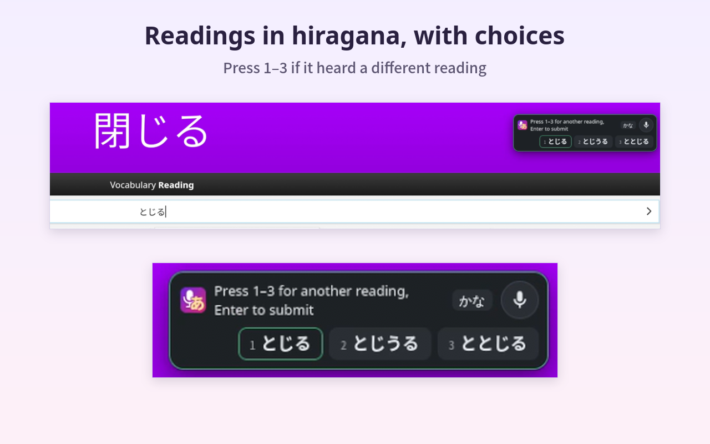
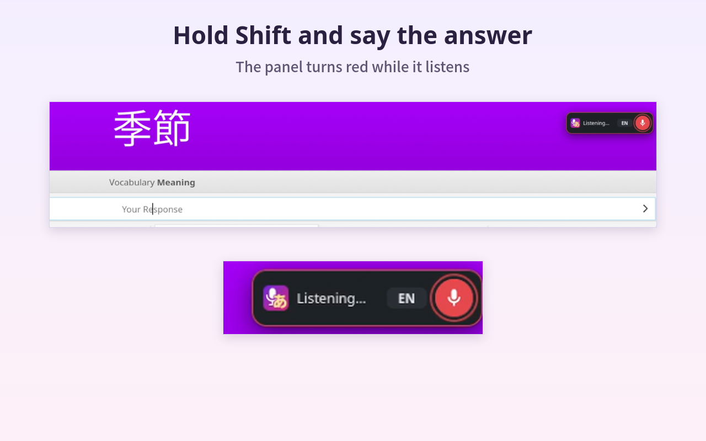
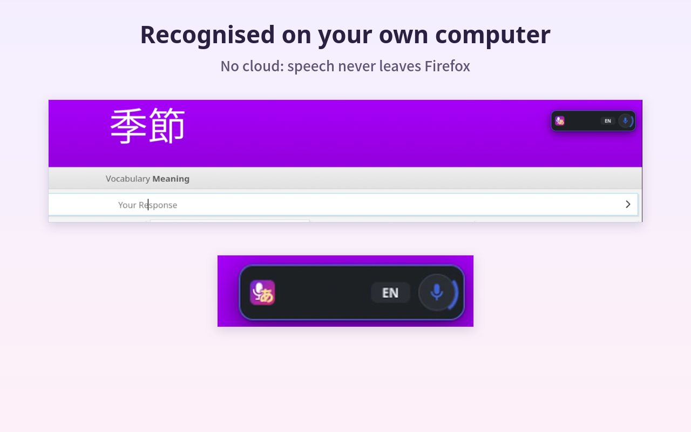
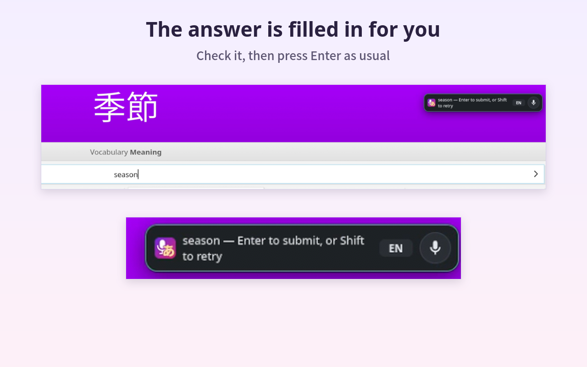
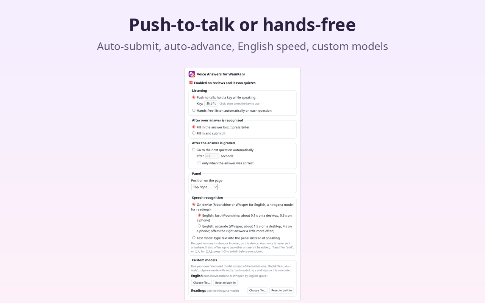
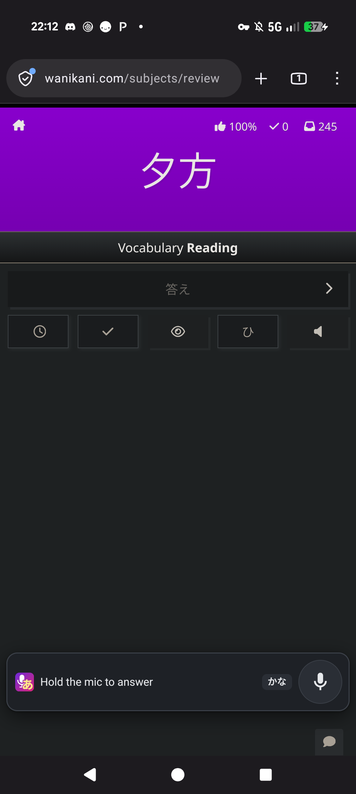
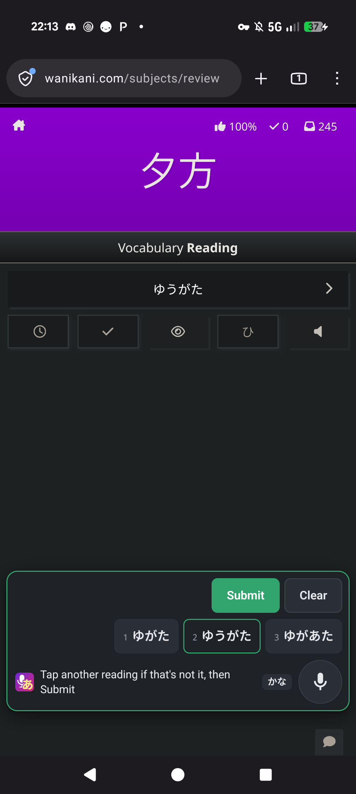
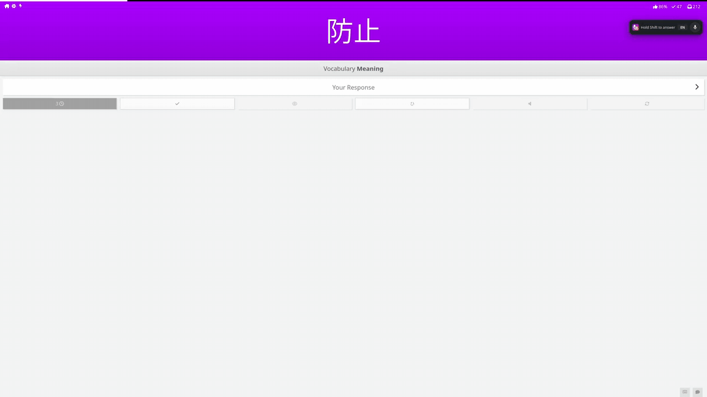
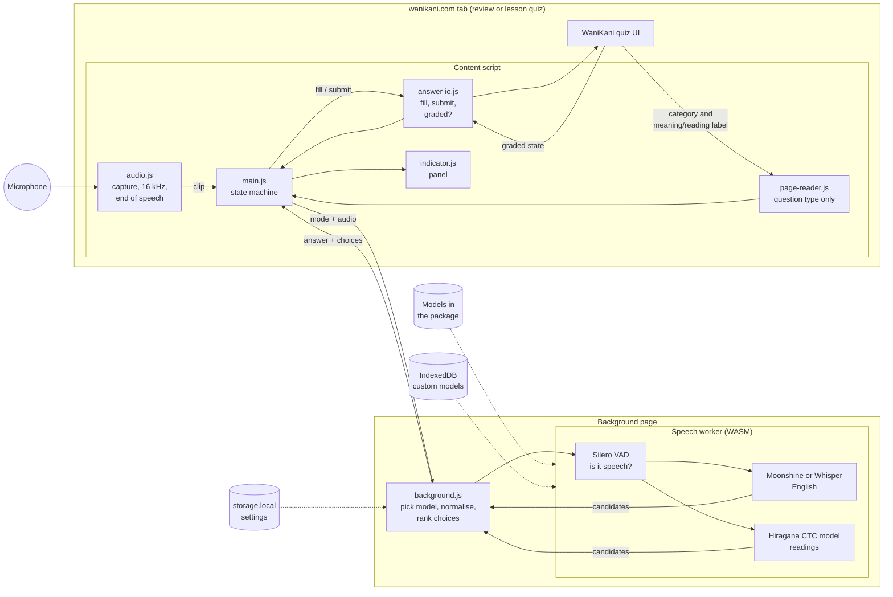
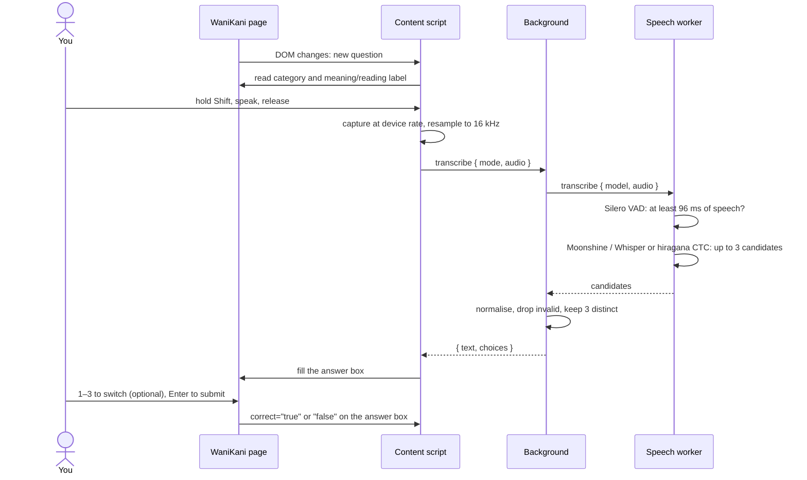

# Voice Answers for WaniKani

> **This extension was written with Claude.** All of its code, tests, tools
> and documentation were written by [Claude Code](https://claude.com/claude-code)
> (Anthropic's Claude Opus 5.5), directed and tested by a human.

A Firefox extension for answering [WaniKani](https://www.wanikani.com) reviews
and lesson quizzes by voice. Speech recognition runs entirely on your
computer, inside Firefox. Nothing you say is sent anywhere.

- **Meanings and radical names** in English: Moonshine base (*fast*, the
  default) or Whisper base.en (*accurate*).
- **Firefox, Chrome and Android:** Firefox and Chrome (and other Chromium
  browsers, such as Edge) on Windows, macOS and Linux, and Firefox for
  Android, where everything works by touch.
- **Readings** in hiragana: a small speech model that writes kana directly,
  so it never has to guess a reading from kanji.
- **Choices:** besides its best guess, the panel offers up to two other
  answers it heard (*hand* for *and*, にん for じん). Press **1–3** to switch
  before you submit.
- **Your rules:** it never looks at the question, only whether a meaning or
  a reading is asked for. A wrong answer goes in exactly as you said it.

<p align="center">
  
</p>

Version 0.1.2. The design notes, measurements and roadmap are in [PLAN.md](PLAN.md).

## Contents
- [Screenshots](#screenshots)
- [Demo](#demo)
- [Install](#install)
- [Requirements](#requirements)
- [Using it](#using-it)
- [Privacy](#privacy)
- [How it works](#how-it-works)
- [Custom and fine-tuned models](#custom-and-fine-tuned-models)
- [Development](#development)
- [Licence](#licence)
- [Support](#support)

## Screenshots

| | |
|---|---|
|  |  |
| Hold Shift and say the answer | Recognised on your own computer |
|  |  |
| The answer is filled in for you | Readings in hiragana, with choices |
|  | |
| Settings: push-to-talk or hands-free, auto-submit, custom models | |

On a phone (Firefox for Android, Pixel 9 Pro XL):

| | |
|---|---|
|  |  |
| Hold the mic button and speak | Tap a choice, then Submit (or Clear) |

## Demo

A muted, full-screen recording of real reviews: answering meanings and a
reading by voice, choosing between readings, and a wrong answer staying on
screen. ([MP4](docs/media/demo.mp4))

<a href="docs/media/demo.mp4"></a>

## Install

**Signed package (release Firefox):** `npm run package -- --sign` (see
[Packaging and signing](#packaging-and-signing)) produces
`dist/voice-answers-for-wanikani-<version>-signed.xpi`. Install it from
`about:addons` → gear menu → **Install Add-on From File…**.

**From source (temporary, for development):**

```bash
git lfs pull     # models and test audio live in Git LFS
npm ci
npm run build    # -> build/ (~185 MB: three speech models, a speech detector, the WASM runtime)
```

Then `about:debugging#/runtime/this-firefox` → **Load Temporary Add-on…** →
`build/manifest.json`. A temporary add-on is removed when Firefox restarts.

**Chrome, Edge and other Chromium browsers (from source):**
`node tools/build.mjs --target chrome` → `build-chrome/`. Open
`chrome://extensions`, turn on **Developer mode**, **Load unpacked** →
`build-chrome/`. It stays installed across restarts.

## Requirements

**No GPU is needed, and none is used.** Firefox has no WebGPU on Linux, so
the add-on runs its speech models on the **CPU**, on a single core,
in WebAssembly (extension pages can't use WASM threads in Firefox). What
matters is one core's speed and some memory:

| Recognition time per answer | Desktop: AMD Ryzen 9 9950X3D | Phone: Pixel 9 Pro XL |
|---|---|---|
| English, *fast* (Moonshine base, default) | ~0.1 s | 0.25–0.4 s |
| English, *accurate* (Whisper base.en) | 1.5–1.7 s | 4–5 s |
| Readings | ~0.4 s | ~0.5 s |
| Extra memory with the models loaded | ~430 MB (*fast*), ~720 MB (*accurate*) | |

Measured 2026-10-06 (desktop *accurate* and readings 2026-10-04), from the
end of recording to the recognised answer. Whisper always processes a 30 s
window, however short the answer, while Moonshine and the readings model
process only what you said, which is why *fast* is so much faster. On 25
recorded meanings, *fast* got 20–21 right first time (the right answer among
its choices: 21–22), *accurate* 22 (25). The download is ~150 MB (about
205 MB installed).

That desktop CPU has one of the fastest single cores available, so treat
its numbers as best case. Time scales roughly with single-core speed: on a
typical laptop expect about **1.5–2.5× longer** (an estimate, not measured).
Any 64-bit desktop CPU from the last decade runs it. Firefox 140 or newer is
required on desktop, Firefox 142 or newer on Android, Chrome 116 or newer
(or a Chromium browser of that age).

A GPU only matters for the optional fine-tuning tools (PyTorch). Even there
the CPU is enough: ~7 minutes for 400 recordings on the CPU above.

## Using it

Open a review session (`/subjects/review`) or a lesson quiz. A panel appears
at the top right with the add-on's icon, a status message, an `EN` / `かな`
tag for the kind of answer expected, and a mic button.

1. **Hold Shift**, say the answer, release. The first press asks for the
   microphone.
2. The answer is filled in. If other answers were also likely, they appear
   as numbered choices: **1–3** switch between them, as long as you haven't
   started typing your own.
3. **Enter** submits (default), and Enter again moves on, as usual on WaniKani.

The panel border shows what's happening: red while listening, blue while
recognising, green when an answer is filled in, amber for "didn't hear
anything" and other problems. You can also **hold the panel's mic button**
instead of Shift, and use its **Submit** and **Next** buttons. **Alt+Shift+V**
pauses and resumes (or untick *Enabled* in the settings); while paused,
pressing the mic button turns voice answers back on.

### On a phone (Firefox for Android)

Everything works by touch. The panel is a bar at the bottom of the screen
(it moves above the on-screen keyboard when that's open):

- **Hold the mic button**, speak, let go. Letting go well away from where you
  pressed cancels.
- **Tap** a choice to switch to it, **Submit** to submit, **Clear** to empty
  the answer box without bringing up the keyboard, **Next** for the next
  question.
- The microphone uses Android's automatic gain: a phone's raw microphone
  signal is far quieter than a desktop's.
- A custom model (below) is installed the same way: copy the
  `.wkv-model.zip` to the phone and choose it in the settings.

**Settings** (toolbar button, or about:addons → Preferences):

| Setting | Options (default first) |
|---|---|
| Listening | push-to-talk · hands-free (listens on each question, stops after 3 misses in a row) |
| Push-to-talk key | **Shift** (either side) · any other key (not shown on touch-only devices) |
| After recognition | fill in only · fill in and submit |
| After grading | stay · go to the next question after a delay (optionally only when correct) |
| Panel position | top right (bottom right on Android) · top left · bottom right · bottom left |
| English speed | fast (Moonshine base) · accurate (Whisper base.en, slower) |
| Speech recognition | on-device · test mode (type instead of speaking) |
| Custom models | your own fine-tuned model per language (see below) |

**Microphone tip:** system noise gates and suppressors (for example an
EasyEffects input chain) cut off the start of words and noticeably hurt
recognition: hand → "and", four → "or". The extension asks Firefox for
raw audio, but tools like EasyEffects capture every app's microphone unless
Firefox is excluded (EasyEffects: input blocklist).

## Privacy

| Guarantee | How it's enforced |
|---|---|
| Your voice never leaves the computer | Recognition runs in a WASM worker inside the extension. Models and runtime ship in the package. Remote model loading is disabled. The extension's CSP allows connections only to itself (`connect-src 'self'`) |
| No network requests at all | `test/policy.py` fails on any network API or outside URL in `src/`. Every test run routes all traffic through a recording proxy and **fails if anything goes anywhere but the browser vendor's own hosts**: a full run sees only Firefox's traffic to Mozilla (or Chromium's to Google) |
| The question is never used | Only `page-reader.js` reads the page, and only the question-type labels. The recogniser's input is the audio plus `en` / `ja-kana`. WaniKani's quiz events are timing signals; their payloads (which contain the item) are never read. All of this is checked by `test/policy.py` |
| Minimal permissions | `storage`, plus access to `www.wanikani.com` only (Chrome adds `offscreen`, for the speech worker). Settings live in `storage.local` (never synced). `data_collection_permissions: none`. Privacy policy: [PRIVACY.md](PRIVACY.md) |
| Custom models stay local | A chosen model file is read from disk into the extension's IndexedDB |

## How it works

### Data flow



The only page content that crosses into the recogniser is the question
**type**, reduced to a mode (`en` or `ja-kana`). The only thing written back
is the answer box.

### One answer, step by step



### Components

| Part | File | What it does |
|---|---|---|
| Page reader | `src/content/page-reader.js` | Activates on `/subjects/review`, `/subject-lessons/<ids>/quiz` and `/subjects/lesson/quiz`. Reads the category (radical, kanji, vocabulary) and the meaning/reading label, and nothing else |
| Answer I/O | `src/content/answer-io.js` | Sets the answer with the native value setter plus an `input` event (WaniKani's own input handling sees a normal edit), clicks the submit button, and reads only whether the answer was graded and whether it was correct |
| State machine | `src/content/main.js` | ready → listening → processing → filled → waiting, re-derived from the DOM on every change, because WaniKani's events fire twice and their order isn't relied on. Handles push-to-talk (Shift chords and taps under 200 ms are ignored), hands-free, choices, auto-submit/advance, pausing and hidden tabs |
| Audio | `src/content/audio.js` | Raw microphone (no browser noise suppression or auto-gain), captured at the device rate (Firefox can't mix sample rates) and box-filter resampled to 16 kHz. 300 ms pre-roll. An energy detector in 20 ms frames ends hands-free utterances. Anything audible is sent on |
| Panel | `src/content/indicator.js` | A closed shadow root, so WaniKani's CSS and scripts can't touch it. The icon is inlined at build time, so the page loads nothing from the extension |
| Background | `src/background/background.js` | Owns the worker, picks models (built-in or custom, with fallback), normalises and ranks candidates. Review tabs send a 5 s heartbeat, because Firefox otherwise unloads an idle background page and the loaded models with it |
| Worker | `src/worker/` | transformers.js + onnxruntime-web (plain WASM build, single thread), bundled by esbuild. Remote models are off and the WASM runtime comes from the package |
| Chrome background | `src/background/service-worker.js`, `offscreen-host.js`, `src/offscreen/` | Chrome only. A Manifest V3 background is a service worker, which can't start workers and is stopped when idle, so the speech worker runs in an offscreen document that keeps the models loaded; `offscreen-host.js` gives `background.js` a stand-in with a Worker's interface that relays to it. After a service-worker restart the models are still there |
| Wire format | `src/shared/wire.js`, `browser-shim.js` | Audio clips cross extension contexts as base64 (Chrome sends messages as JSON). The shim maps Chrome's `chrome.*` to `browser.*` (both promise-based) |
| Normalisation | `src/shared/normalize.js` | Turns recogniser output into an answer, without correcting it (below) |

### Recognition

**English (Moonshine base or Whisper base.en).**
- Alternatives come from the next most likely *first* tokens (within 5% of
  the best), each completed greedily, because that's where the confusions
  are (eye / I, hand / and). The audio is encoded once and reused for every
  candidate.
- **Whisper** decoding starts from a fixed, question-independent prompt of
  dictionary-style words, which nudges it towards short answers ("Hand."
  rather than "And").
- **Moonshine** has no prompt. On single words it tends to stop before
  saying anything or to say the word twice ("king king"), so it must produce
  at least one token (the speech gate has already found speech), and a
  phrase repeated back to back is collapsed. Neither looks at the question.

**Readings (hiragana CTC).**
- `distilhubert-hiragana-ctc`, exported to ONNX with partial 8-bit
  quantisation. It emits hiragana per 20 ms frame, with no language model
  that could invent words.
- The first choice is the greedy decode; a CTC prefix beam search
  (`src/worker/ctc.js`) supplies alternatives within 5% of the best.

**Speech gate.** Silero VAD (2 MB) runs on every clip first. Key clicks and
silence are rejected before a recogniser ever sees them; Whisper would
otherwise "hear" something in silence.

**Normalisation** (no correction, nothing from the question):
- **English:** lower-case and strip punctuation. Numbers become words up to
  ten and numerals above (`4` → *four*, *twenty-one* → `21`).
  Hesitations (*um*, *uh*) are rejected.
- **Readings:**
  - katakana → hiragana
  - ー is spelled out: o- and u-rows take う, the e-row takes い, the a- and
    i-rows repeat the vowel (きょー → きょう). The form with ー is offered as
    a choice, since some readings really contain it (びーだま).
  - kanji, romaji and readings starting with ん, っ or a small kana are
    rejected, never converted.

**Accuracy** on the author's own recordings, from [PLAN.md](PLAN.md):

| Answers | Right reading among the choices |
|---|---|
| English: 25 words | 25/25 (first choice 22/25) |
| Readings: 31 words, generic model | 13/31 |
| Readings: 31 words, fine-tuned on the author's voice | 24/31 |

### Custom and fine-tuned models

Settings → **Custom models** lets you replace the built-in model for English
or for readings with your own:
- **Making the file:** `.wkv-model.zip` files are made by
  `tools/pack-model.mjs MODEL_DIR --language en|ja-kana`. The file is checked
  (language, model type, required files, vocabulary) and stored in the
  extension's IndexedDB.
- **Loading it:** the worker serves its files to transformers.js through its
  cache hook.
- **If it doesn't load:** that language falls back to the built-in model,
  and the panel says so.

Fine-tuning the reading model on your own voice (see PLAN.md, Phase 4).
With a few hundred recordings this took first-choice accuracy from 13/31 to
18/31 and choices from 13/31 to 24/31:

```bash
mkdir -p ~/.config/wanikani-voice        # a read-only WaniKani API token goes in api-token
python3 tools/wk-readings.py            # your unlocked readings -> personal/words.json
python3 tools/recorder/server.py --words personal/words.json --set personal   # record at http://localhost:8765/
python tools/finetune-hiragana.py       # needs torch + transformers; ~7 min on CPU for 400 clips
python tools/export-dual-ctc.py personal/models/distilhubert-hiragana/checkpoint - personal/models/distilhubert-hiragana
node tools/pack-model.mjs personal/models/distilhubert-hiragana --language ja-kana --name "My voice"
```

Then choose the `.wkv-model.zip` in the settings. (`npm run build -- --personal`
builds it in instead; personal builds are never packaged or signed.)

Fine-tuning the English model (Moonshine, the *fast* default) works the same
way. A share of the list is held out to measure it. On 300 recordings this
took held-out first-choice accuracy from 40/60 to 46/60, and from 20/25 to
23/25 on older recordings of other words, close to or above Whisper base.en
(49/60, 22/25) at a fifth of its decode time:

```bash
node tools/wk-meanings.mjs              # 300 of your unlocked meanings -> personal/words.json (keeps the readings)
python3 tools/recorder/server.py --words personal/words.json --set personal
node tools/eval-asr.mjs moonshine-base whisper-base.en --personal   # held-out clips; "--personal all" for every clip
python tools/finetune-moonshine.py      # train on the train split; picks the best epoch on 10% of it (~2 min on CPU)
python tools/export-moonshine.py personal/models/moonshine-base-ft
node tools/eval-asr.mjs moonshine-base-ft --models-root personal/models --personal
python tools/finetune-moonshine.py --all --epochs 2   # final model: every recording, the epoch count found above
node tools/pack-model.mjs personal/models/moonshine-base-ft --language en --name "My voice (English)"
```

A custom English model can be a Moonshine or a Whisper one.

The WaniKani token is used only by `wk-readings.py` and `wk-meanings.mjs`;
the extension never calls the WaniKani API.

## Development

### Tests

```bash
python3 -m venv .venv && .venv/bin/pip install selenium
# geckodriver: https://github.com/mozilla/geckodriver/releases (on PATH or $GECKODRIVER)
npm run build && .venv/bin/python test/run_tests.py   # --headed to watch, -k name to filter
# Chrome: chromium + chromedriver on PATH (Arch: pacman -S chromium)
node tools/build.mjs --target chrome && .venv/bin/python test/run_tests.py --browser chrome
```

- **`test/policy.py`:** the static privacy and page-access checks above.
- **Unit tests** for normalisation and the CTC beam search (`test/unit/`),
  run in Firefox.
- **End-to-end tests** in headless Firefox against a mock review page
  (`test/mock/review.html`, modelled on the live page). They use a test copy
  of `build/` that also matches `http://localhost`, with a bridge for
  settings, a fake microphone, diagnostics and custom-model installs
  (`test/hooks/`).
  - **Real speech:** WAV clips are played into the fake microphone.
  - **Also covered:** push-to-talk and hands-free, choices in both
    languages, lesson quizzes, custom models (including fallback), the
    settings page, and the background surviving Firefox's idle unloading.
- **Privacy audit:** the run fails if any request goes anywhere but the
  browser vendor's hosts.
- **Chrome:** the same suite in headless Chromium with `build-chrome/`,
  plus a test that Chrome stopping the service worker loses nothing (the
  models live in the offscreen document); the Firefox idle-unload test is
  Firefox only.

Tests that need real voice recordings are skipped unless the private
`personal/` submodule is checked out.

### Model tools

```bash
node tools/fetch-models.mjs [name]                       # pinned, sha256-checked downloads (models/models.json)
node tools/eval-asr.mjs [model ...] --set real-raw [--ja]  # accuracy on recordings, same pipeline as the extension
node tools/pack-model.mjs MODEL_DIR --language en|ja-kana  # custom model file for the settings
```

Only models marked `"bundled": true` in `models/models.json` ship. The
hiragana model is exported locally (`"generatedBy"` has the exact command).

### Packaging and signing

```bash
npm run package                # dist/: .xpi, source zip for AMO review, SHA256SUMS
npm run package -- --verify    # also rebuild from the source zip and compare every file
npm run package -- --sign      # also get it signed by Mozilla (unlisted channel)
npm run package -- --sign --listed   # submit to the public store instead (see store/LISTING.md)
npm run package -- --target chrome   # dist/…-chrome.zip for the Chrome Web Store and Edge Add-ons (see store/CHROME-LISTING.md)
```

What the package script does:
- **Checks first:** a clean normal build (never a personal one), the policy
  check, `web-ext lint` (errors fail) and the 200 MB limit. The working tree
  must be committed.
- **Signing** submits the package with its source zip to addons.mozilla.org
  on the unlisted channel: automated review, then signed for
  self-distribution, not listed on the store.
- **Credentials:** AMO API credentials go in
  `~/.config/wanikani-voice/amo-credentials` as
  `{"issuer": "user:…", "secret": "…"}` (`chmod 600`).
- **Versions:** each version can be signed once.

### Private data

`personal/` is a private submodule (voice recordings, the WaniKani word list,
fine-tuned models). Nothing in it is needed to build, test or package the
add-on. With access:

```bash
git submodule update --init personal
(cd personal && git lfs install --local && git lfs pull)
```

### Layout

```
manifest.json
src/content/       page-reader, answer-io, audio, indicator, main (content script)
src/background/    background page: models, transcription, choices
src/worker/        speech worker: transformers.js, Moonshine/Whisper + CTC decoding, Silero VAD
src/shared/        settings, normalisation, zip reader, custom model store
src/options/       settings page / toolbar popup
models/            bundled models (Git LFS) + models.json
icons/             icon (tools/make-icon.py)
tools/             build, package, model fetch/eval/export/pack, fine-tuning, recorder
test/              policy, unit and end-to-end tests, mock page, synthetic audio
personal/          private submodule (not needed to build)
```

## Licence

[MIT](LICENSE). Bundled models and libraries keep their own licences: see
[THIRD_PARTY_NOTICES.md](THIRD_PARTY_NOTICES.md).

## Support

If Voice Answers for WaniKani helps your reviews, you can
[buy me a coffee](https://buymeacoffee.com/jsmrcina).
